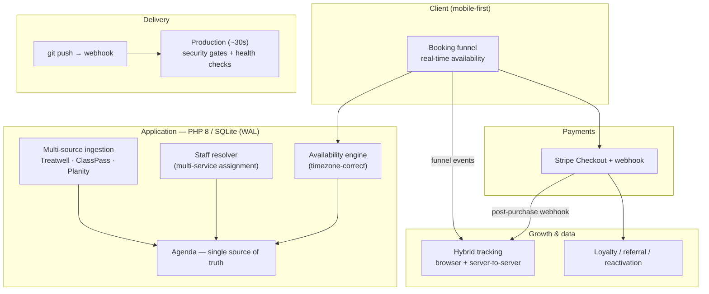

# You Rêve Paris — Engineering & Growth Platform

**Design, architecture, and hands-on engineering of the full digital platform behind [You Rêve Paris](https://ureve.paris), a Parisian beauty salon — from the payment-backed booking funnel to the marketing/data stack.**

🇬🇧 English · [🇫🇷 Version française](README.fr.md)

> ### ℹ️ About this repository
> This is a **sanitized public showcase**, not the production codebase. The real platform is
> private: it processes live Stripe payments and customer personal data, so publishing it would
> mean leaking secrets, exposing customer PII (GDPR), and handing the live site's booking and
> anti-fraud logic to anyone who asked.
>
> Instead, the code under [`examples/`](examples/) is **purpose-written, standalone, and
> dependency-free** — clean re-implementations of representative problems I solved, containing
> **no secrets, no credentials, and no customer data**. Every example ships with runnable tests.

---

## The role

I'm the CTO of You Rêve Paris. It's a **full-ownership, end-to-end role** on a live commercial
site: I set the technical and data strategy, and I write the code. In practice that spans:

- **Product & architecture** — the booking product, the domain model, the deployment pipeline, and the security posture.
- **Full-stack engineering** — a trilingual PHP/SQLite application: booking funnel, real-time availability, staff agenda, multi-source ingestion.
- **Growth & data engineering** — a hybrid browser + server-to-server tracking stack, marketing automation, and SEO/GEO for AI answer engines.
- **Business strategy** — channel economics (walk-ins vs. marketplaces vs. owned demand), paid-acquisition ROI, and expansion analysis for a second location.

The through-line: **turn a beauty salon's operations into software, and turn its data into growth** — as a one-person engineering function amplified by an autonomous AI development workflow.

---

## What the platform does

| Capability | What it involves |
|---|---|
| **Booking funnel** | Mobile-first, Stripe payments, real-time availability, multi-service & multi-guest bookings, single source of truth for slots. |
| **Intelligent agenda** | Automatic staff assignment across multi-service appointments, re-optimization of the day's schedule on cancellation. |
| **Multi-source ingestion** | Reconciles bookings from Treatwell, ClassPass, Planity & Airbnb into one calendar — parsing, de-duplication, reschedule matching. |
| **Marketing & data** | Hybrid 3-tier tracking (browser Pixel/gtag + server-to-server Conversions APIs), loyalty & referral programs, audience sync. |
| **Trilingual site + SEO/GEO** | FR / EN / 中文, auto-published editorial calendar, structured data, and optimization for AI answer engines (AI Overviews, ChatGPT, Perplexity). |
| **Continuous delivery** | Push-to-production in ~30s via webhook, gated by automated secret-scanning and diff-safety checks. |

---

## Architecture at a glance



**Design principles that recur throughout the system:**

- **One source of truth for availability.** The agenda — not any marketplace — is authoritative. Every channel writes into it, and the funnel reads from it, so double-bookings are structurally hard.
- **The server is the authority.** Pricing, promo validation, and availability are decided server-side; the client is a fast, resilient view that self-heals if an asset fails to load.
- **Correctness at the boundaries.** Timezones, money, and messy third-party data are where booking systems quietly break — so those are exactly where the logic is isolated and unit-tested (see below).
- **Ship small, ship safe.** Continuous deployment is only safe because every push passes automated security gates and post-deploy health checks.

---

## Engineering deep-dives (runnable)

Three representative problems, each isolated into clean, dependency-free code with its own tests.
No framework required — clone and run:

### 1. Timezone-correct availability engine → [`examples/availability-engine/`](examples/availability-engine/)

The bug that quietly corrupts almost every home-grown booking system: computing bookable slots
in the salon's **wall clock** (Europe/Paris, DST-aware) while storing instants as UTC. A naive
offset or `toISOString()` round-trip is wrong for half the year and can roll slots onto the wrong
day near midnight. This engine never does offset arithmetic by hand — every instant is anchored to
the business timezone and resolved by the runtime, DST included.

```bash
php examples/availability-engine/test.php   # 13 checks, incl. a DST-transition day
```

### 2. Multi-service staff assignment → [`examples/staff-assignment/`](examples/staff-assignment/)

A Treatwell booking often bundles several services back-to-back. The resolver assigns
practitioners by a real business rule, in priority order: (1) keep the client with **one**
practitioner for the whole appointment; (2) if impossible, **split** onto contiguous segments
while **minimizing hand-offs**; (3) **never** double-book. It's a small constraint-satisfaction
problem, solved with a depth-first search whose candidate ordering makes the first solution found a
good one (reuse existing staff, then load-balance).

```bash
php examples/staff-assignment/test.php      # 15 checks
```

### 3. Messy multi-source booking ingestion → [`examples/booking-ingestion/`](examples/booking-ingestion/)

Marketplace data is hostile: Treatwell concatenates service names with no separator
(`Dépose gelBeauté des piedsRemplissage gel`), ClassPass sprinkles narrow no-break spaces
(U+202F) between numbers and units, prices use comma decimals, and some sources ship **no stable
booking id** at all. This normalizer splits on lost word boundaries, neutralizes exotic Unicode
whitespace, extracts embedded duration/price, and builds a **deterministic content signature** so a
rescheduled booking reconciles in place instead of duplicating.

```bash
php examples/booking-ingestion/test.php     # 13 checks
```

### 4. On-device colorimetry — capture · analysis · rendu → [`examples/color-matcher/`](examples/color-matcher/)

A selfie-to-shade recommender that runs **entirely on the client** — no photo ever leaves the
browser (privacy by construction). This is its headless algorithmic core, in JavaScript: **capture**
(reduce a burst of noisy camera frames to one trustworthy skin colour, rejecting outlier frames),
**analysis** (reference-card-free white balance, then CIELAB + the dermatology **ITA°** metric and a
warm/cool undertone), and **rendu** (rank catalogue shades by undertone harmony, perceptual
distinctiveness via **CIEDE2000**, and hue harmony — each recommendation explained, not a black box).
The CIEDE2000 implementation is validated against the Sharma 2005 paper's published reference data.

```bash
node examples/color-matcher/test.mjs        # 32 checks, incl. CIEDE2000 reference data
```

Run everything at once:

```bash
for t in examples/*/test.php; do php "$t"; done   # PHP examples (1–3)
node examples/color-matcher/test.mjs              # JS example (4)
```

---

## Growth & data engineering

The platform isn't just operational software — it's an acquisition and retention engine.

- **Hybrid 3-tier tracking.** Browser-side pixels and `gtag` for funnel events, **plus** server-to-server Conversions APIs fired from the Stripe webhook — with first-party identity stitching so browser and server conversions match. Server-side is the resilient backstop when browsers block client-side tags.
- **Marketing automation.** Loyalty points, a VIP referral program, and reactivation campaigns — driven off the same booking database, with guards so active customers are never wrongly targeted.
- **Audience sync.** Programmatic sync of first-party audiences (Customer Match / custom audiences + lookalikes) to close the loop between CRM data and paid channels.
- **SEO / GEO.** A trilingual editorial calendar auto-published on schedule, Schema.org structured data, `hreflang`, IndexNow, and passage-level optimization for AI answer engines — because discovery increasingly happens inside an LLM, not a blue-links page.

---

## AI-augmented engineering

This is a one-person engineering function operating at a scope that normally needs a team — made
possible by an **autonomous AI development workflow** (Claude Code) that I designed around hard
guardrails:

- **Parallel autonomous agents**, each isolated in its own git worktree, so several streams of work run without clobbering each other.
- **Automated security gates before every push** — secret scanning, sensitive-filename detection, and diff-size safety — so speed never trades against safety.
- **Self-healing operations** — deploy-conflict detection, health-check crons, and disciplined debug/rollback procedures that keep production honest without manual babysitting.

The point isn't "AI wrote the code." It's that I built a **system for shipping and operating a
production platform safely at high velocity**, with AI as the force multiplier and rigorous
engineering discipline as the safety rail.

---

## Selected outcomes

- **Consolidated fragmented booking channels** (walk-ins, Treatwell, ClassPass, Planity, direct) into a single authoritative agenda — removing the double-booking and reconciliation pain of running several disconnected calendars.
- **Reduced dependency on low-margin marketplaces** by building an owned booking funnel and steering demand toward it.
- **Built a data-driven acquisition loop** — server-side conversion tracking → paid-channel optimization → ROI dashboards — targeting the segments that actually convert.
- **Sustained high shipping velocity solo**, via continuous deployment gated by automated security and health checks.

*(Specific commercial figures are intentionally omitted from a public repository.)*

---

## Tech stack

**Backend** PHP 8 · SQLite (WAL) · Stripe · PSR-style OOP · PHPUnit
**Frontend** Progressive-enhancement JS · on-device computer vision (`face-api.js`, CIELAB/CIEDE2000 colour science) · self-hosted assets under a strict CSP · mobile-first
**Data / growth** GA4 · Meta Pixel + Conversions API · Google Ads API · server-side GTM (Cloud Run) · IndexNow
**Infra / delivery** OVH · git-webhook continuous deployment · automated security gates · monitoring crons · off-site encrypted backups
**Practices** i18n (FR/EN/中文) · Schema.org / GEO · AI-augmented development (Claude Code)

---

## Repository layout

```
.
├── README.md                     ← you are here (English)
├── README.fr.md                  ← French version
└── examples/                     ← runnable, dependency-free showcases
    ├── availability-engine/      ← timezone-correct slot generation (PHP)
    ├── staff-assignment/         ← multi-service practitioner assignment (PHP)
    ├── booking-ingestion/        ← messy multi-source data normalization (PHP)
    └── color-matcher/            ← on-device colorimetry: capture · analysis · rendu (JS)
```

Each example folder has its own README explaining the problem, the approach, and the trade-offs.
The PHP examples run on **PHP ≥ 8.1**; the colorimetry example runs on **Node ≥ 18** — both with
no third-party dependencies.

---

## About

**Dimitri** — CTO, You Rêve Paris.
Live platform: **[ureve.paris](https://ureve.paris)**

Building software and data systems that run a real business — strategy and hands-on engineering,
end to end.
